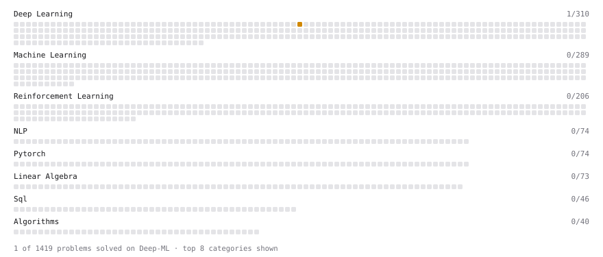

# Deep-ML

My machine learning practice from [Deep-ML](https://www.deep-ml.com). Every solution here was written by hand.

**3** solved · 3 problems · 0 labs · 0 math

[**Browse the interactive portfolio**](https://Liamislazy.github.io/deep-ml/) to replay this filling in over time.

## Problems

| | Difficulty | Solved | |
| --- | --- | --- | --- |
| [Min-Max Scaling of Feature Values](https://www.deep-ml.com/problems/112) | easy | 2026-09-22 | [solution](problems/0112-min-max-scaling-of-feature-values) |
| [Dropout Layer](https://www.deep-ml.com/problems/151) | medium | 2026-09-21 | [solution](problems/0151-dropout-layer) |
| [Find the Best Gini-Based Split for a Binary Decision Tree](https://www.deep-ml.com/problems/138) | medium | 2026-09-24 | [solution](problems/0138-find-the-best-gini-based-split-for-a-binary-decision-tree) |

---

_This file is regenerated by Deep-ML on every push._
